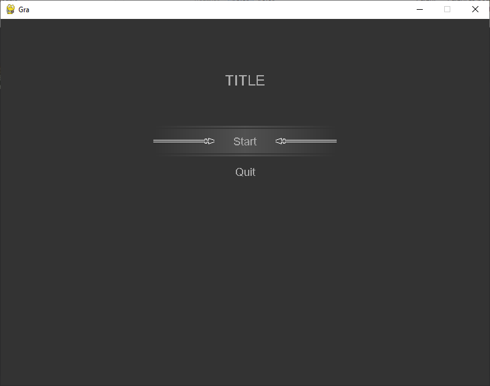
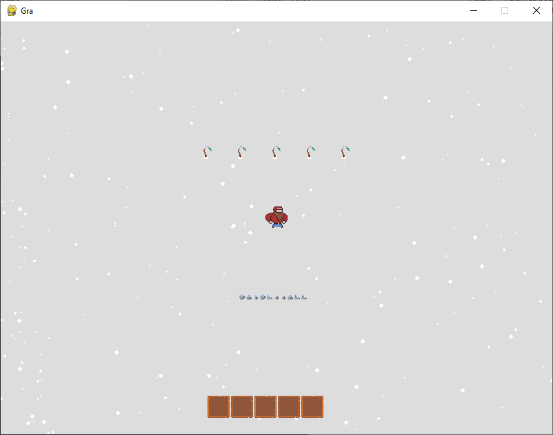
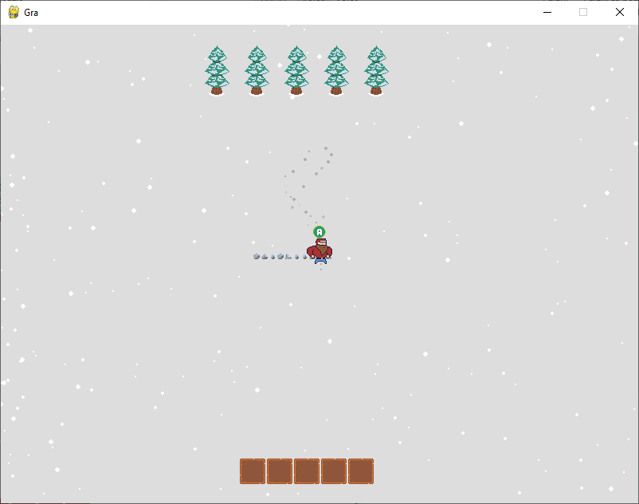
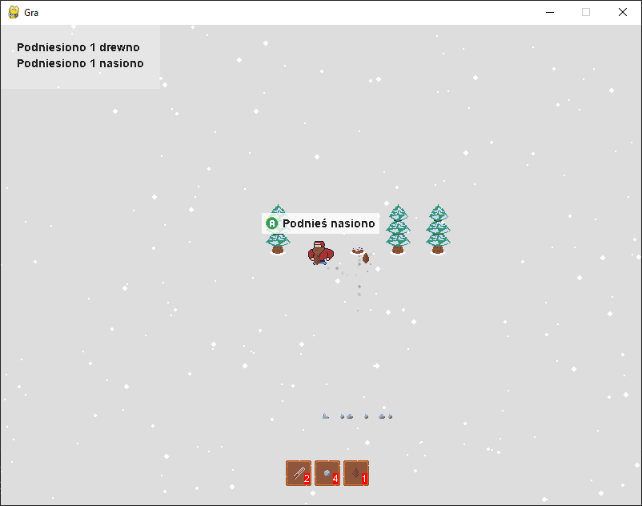
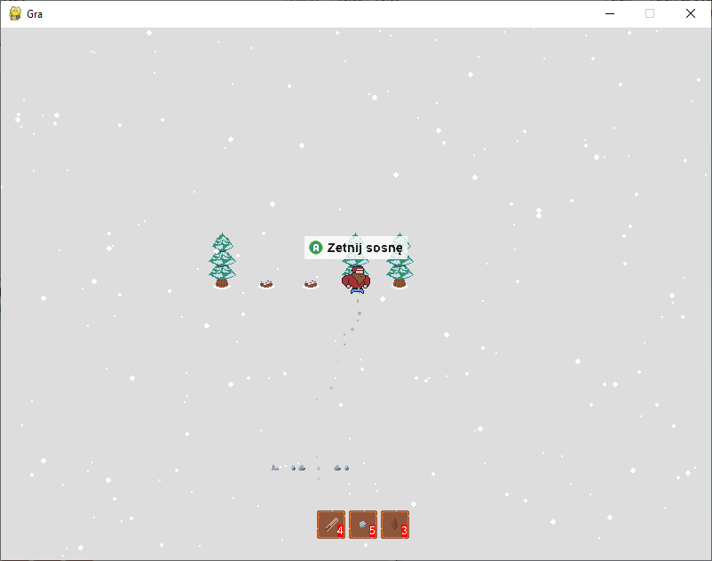
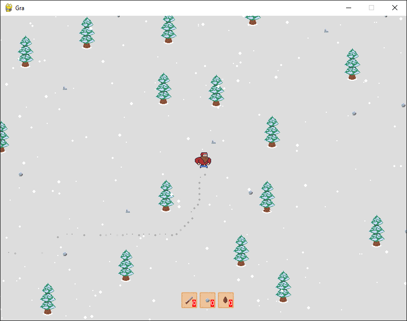

# GJ_2024_2_0
Game Jam 2024 2.0 - zima, grawitacja, ograniczenie

##  Run
In terminal ``py run.py``

## Controls
XBox Controller:
- L-Analog, D-Pad - move
- A - action
- B - run

Keyboard:
- Arrow Keys - move
- Enter, SpaceBar - action
- Shift - run

## Screens

